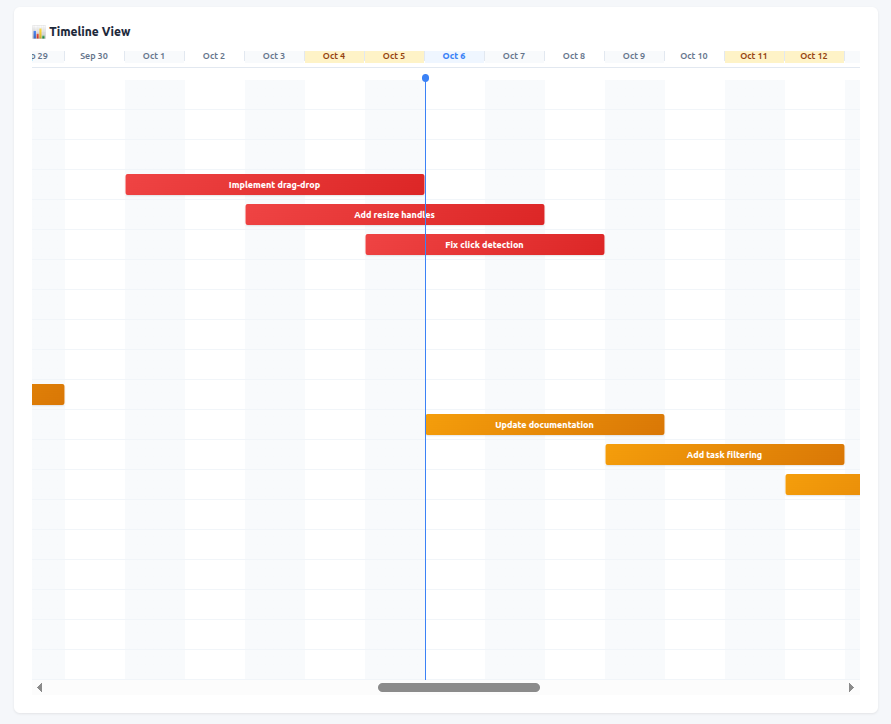
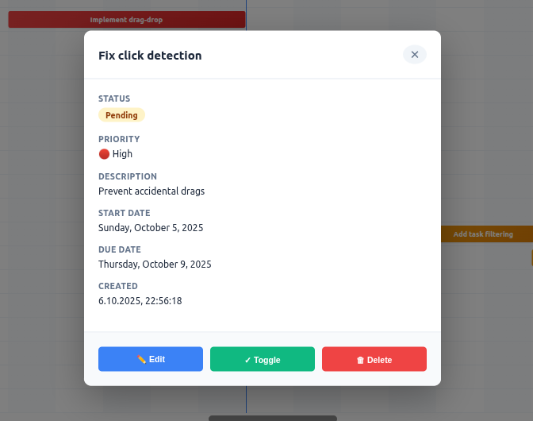

# Gantt Chart Features

Professional 2-month Gantt chart with Excel-style columns, weekend highlighting, and interactive drag-and-drop scheduling.

## Overview

The Task Manager includes a sophisticated Gantt chart that provides visual project management spanning exactly 2 months (60 days) with pixel-perfect alignment, alternating column backgrounds, weekend highlighting, and intuitive drag-and-drop interactions for task scheduling.

## Visual Preview

### Gantt Chart View



The main Gantt chart view showcases:
- **Excel-style alternating columns** with weekend highlighting in amber
- **Color-coded task bars** by priority (red=high, amber=medium, blue=low)
- **Today marker** as a blue vertical line with column highlight
- **Pixel-perfect alignment** at 80px per day
- **Scrollable horizontal chart** spanning 2 months (5,200px wide)
- **Positioned prominently** at the top of the page for immediate visibility

### Task Detail Card



Click any task bar to open the detail card showing:
- **Task title** and full description
- **Status** badge (Pending/Completed with color coding)
- **Priority** level with color indicator (High 🔴 / Medium 🟡 / Low 🔵)
- **Start date** and **due date** with formatted display
- **Created timestamp** for audit trail
- Quick action buttons: **✏️ Edit**, **✓ Toggle complete**, and **🗑 Delete**

## Core Features

### 1. Visual Gantt Chart

**Date Range Display**
- **2-Month Gantt Chart:** Spans exactly 60 days (-30 to +30 days from today)
- **Pixel-Perfect Alignment:** 80px per day with 200px task name offset
- **Scrollable:** Horizontal scrolling for full date range (5,400px wide)
- **Date Headers:** Month and day format (e.g., "Sep 4", "Oct 6")

**Excel-Style Column Backgrounds**
- **Alternating Columns:** Even columns in light gray (#f8fafc), odd columns white
- **Weekend Highlighting:** Saturday and Sunday in amber (#fef3c7)
- **Today Column:** Blue highlight (#eff6ff) with vertical line
- **Grid Lines:** Subtle borders between columns for clear visual separation

**Today Marker**
- **Blue vertical line** indicates current date
- **Circular marker** at the top
- **Column highlight** extends through entire chart
- Always visible when in range

**Task Positioning**
- **UTC Normalization:** All dates normalized to midnight UTC for accuracy
- **Pixel-based positioning:** Precise alignment with date columns
- **Bar length:** Represents exact task duration (days × 80px)
- **Overlapping tasks:** Shown in separate rows for clarity

### 2. Interactive Drag-and-Drop

**Move Tasks (Drag Bar)**
- Click and drag task bar to reschedule
- Both start_date and due_date update
- Duration preserved during move
- Visual feedback while dragging
- Requires 5-pixel minimum movement (prevents accidental moves on click)

**Resize Start Date (Left Handle)**
- Drag left edge to change start date
- Only start_date updates
- Due date remains fixed
- Task duration changes

**Resize End Date (Right Handle)**
- Drag right edge to change due date
- Only due_date updates
- Start date remains fixed
- Task duration changes

### 3. Visual Indicators

**Priority Color Coding**

| Priority | Color | Gradient |
|----------|-------|----------|
| High (2) | Red | `#ef4444` → `#dc2626` |
| Medium (1) | Amber | `#f59e0b` → `#d97706` |
| Low (0) | Blue | `#3b82f6` → `#2563eb` |

**Task Status**
- Completed tasks show faded with strikethrough
- Active tasks have full opacity
- Hover state lifts task bar with shadow

**Resize Handles**
- Semi-transparent white borders
- 8px clickable width
- Highlighted on hover
- Cursor changes to resize (⟷)

### 4. Task Detail Card

**Click to View Details**

Click any task bar to open detail card showing:
- Task title
- Status badge (Completed/Pending)
- Priority level with icon
- Full description
- Start date (formatted)
- Due date (formatted)  
- Creation timestamp

**Quick Actions**
- ✏️ **Edit** - Update task title
- ✓ **Toggle** - Mark complete/incomplete
- 🗑 **Delete** - Remove task (with confirmation)

**Interactions**
- Click task bar to open
- Click overlay (dark area) to close
- Press ESC to close
- Click X button to close

## User Interactions

### Moving a Task

```
1. Hover over task bar (cursor changes to move)
2. Click and hold
3. Drag left (earlier) or right (later)
4. Release to save
   → Both start_date and due_date update
   → Duration preserved
```

### Resizing Start Date

```
1. Hover over left edge (cursor changes to ew-resize)
2. Click and hold left handle
3. Drag left (earlier) or right (later)
4. Release to save
   → Only start_date updates
   → due_date stays the same
```

### Resizing End Date

```
1. Hover over right edge (cursor changes to ew-resize)
2. Click and hold right handle
3. Drag left (earlier) or right (later)
4. Release to save
   → Only due_date updates
   → start_date stays the same
```

### Viewing Details

```
1. Click task bar
2. Detail card appears with full information
3. Use action buttons or click overlay/ESC to close
```

## Visual Feedback

### Hover States

**Task Bar Hover:**
- Lifts 2px upward
- Enhanced shadow
- Z-index raises above others
- Cursor changes to `move`

**Resize Handle Hover:**
- Semi-transparent white background
- Cursor changes to `ew-resize`
- Clear visual indication

### Drag States

**Moving (Drag Entire Bar):**
- 60% opacity
- `grabbing` cursor
- Real-time position updates
- Z-index 100

**Resizing (Drag Handle):**
- 80% opacity
- `ew-resize` cursor
- Width/position updates in real-time
- Z-index 100

### Modal Animation

**Detail Card:**
- Scales from 0.9 to 1.0
- Fades in smoothly
- Backdrop blur effect
- Centered with overlay

## Technical Implementation

### Drag Logic

**Minimum Drag Distance**
- 5-pixel threshold prevents accidental moves
- Click detection: movement ≤ 5px = click
- Drag detection: movement > 5px = drag

**Movement Tracking**
- `hasMoved` flag tracks whether threshold exceeded
- Prevents detail card opening during drag
- Ensures intentional interactions

**Date Calculations**
- Position converted to date based on timeline range
- Pixel-based positioning (80px per day) for precision
- UTC date normalization prevents timezone drift
- Default time: 5:00 PM (17:00) UTC for new dates

### Data Persistence

**API Updates**
- Move: PUT with `start_date` and `due_date`
- Resize start: PUT with `start_date` only
- Resize end: PUT with `due_date` only
- Gantt chart refreshes after successful save

**Error Handling**
- Failed API calls logged to console
- Gantt chart remains unchanged on error
- User can retry operation

## Keyboard Shortcuts

| Key | Action |
|-----|--------|
| `ESC` | Close detail card |

## Responsive Design

### Horizontal Scrolling
- Gantt chart scrolls for long date ranges
- Sticky date headers
- Today marker moves with scroll

### Task Bar Sizing
- Minimum width: 5% of chart width
- Prevents invisible tasks
- Maintains readability

## Empty State

When no tasks have due dates:

```
📅 No tasks with due dates
Add due dates to see the Gantt chart
```

## Usage Tips

### For Effective Scheduling

1. **Quick Reschedule** - Drag task bar to move both dates
2. **Extend Duration** - Drag right handle to extend due date
3. **Start Earlier** - Drag left handle to move start date back
4. **View Details** - Click (don't drag) to see full information

### Best Practices

- Use consistent date formats
- Set realistic deadlines
- Color-code by priority
- Review Gantt chart regularly
- Update completed tasks

## Accessibility Features

- Clear visual indicators
- Distinct hover states
- Keyboard support (ESC)
- High color contrast
- Descriptive tooltips

## Browser Compatibility

- Chrome 90+
- Firefox 88+
- Safari 14+
- Edge 90+

Requires JavaScript enabled for interactive features.

## Performance

### Optimizations

- Hardware-accelerated CSS transforms
- Efficient DOM updates
- Debounced drag calculations
- Minimal reflows/repaints

### Rendering

- Only tasks with due dates shown
- Smart refresh after changes
- Optimized Gantt chart calculations

## Data Flow

```
User Interaction
    ↓
JavaScript Event (mousedown/mousemove/mouseup)
    ↓
Calculate New Position/Date
    ↓
API Request (PUT /todos/{id})
    ↓
Database Update
    ↓
Refresh Gantt Chart
    ↓
Updated Visual Display
```

## Future Enhancements

Potential features for future development:

- Touch support for mobile devices
- Keyboard navigation (arrow keys)
- Multi-task selection
- Dependency arrows between tasks
- Milestone markers
- Resource allocation
- Export Gantt chart as image/PDF
- Zoom levels (day/week/month view)
- Drag-to-create new tasks
- Snap-to-grid alignment

## Example Scenarios

### Scenario 1: Project Delay

**Situation:** Project needs to be pushed back 3 days

**Action:** 
1. Drag task bar 3 days to the right
2. Release
3. Both dates update automatically

**Result:** Task rescheduled, duration preserved

### Scenario 2: Task Takes Longer

**Situation:** Task needs 2 more days to complete

**Action:**
1. Drag right handle 2 days right
2. Release
3. Due date extends

**Result:** End date moved, start date unchanged

### Scenario 3: Start Work Earlier

**Situation:** Can begin task earlier than planned

**Action:**
1. Drag left handle 2 days left
2. Release
3. Start date moves back

**Result:** Earlier start, same end date

## Related Documentation

- [Gantt Drag & Drop](GANTT_DRAG_DROP.md) - Technical implementation
- [API Reference](API.md) - Date field formats
- [Testing Guide](TESTING.md) - Gantt test coverage

---

**Gantt Chart**: Interactive, intuitive, professional  
**Features**: Drag, resize, visual scheduling  
**Status**: Fully functional ✅
